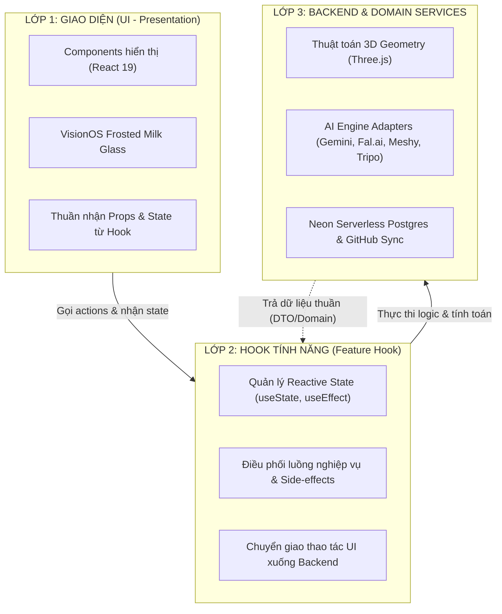

# 🔮 3D HUB v2 - TÀI LIỆU KIẾN TRÚC CỐT LÕI & HƯỚNG DẪN HỆ THỐNG
> **Dành cho AI Agent & Kỹ sư phần mềm**  
> *Ngôn ngữ thiết kế: Apple VisionOS Spatial Glassmorphism (Trắng Kem + Xanh Cyan Kem)*  
> *Mô hình kiến trúc: Clean Architecture 3 Lớp (UI - Feature Hook - Backend) theo Function Modules*  
> *Hệ cơ sở dữ liệu: Neon Serverless PostgreSQL (Scale-to-Zero trên Vercel)*  
> *Đồng bộ tri thức: GitHub Sync cho Obsidian Knowledge Vault*  
> *Phiên bản: 2.1.0 • Cập nhật: 2026-10-09*

---

## 🏛️ 1. Triết Lý Thiết Kế & Kiến Trúc Cốt Lõi

Hệ thống **3D Hub v2** được xây dựng nhằm giải quyết bài toán biến hình ảnh/ý tưởng thành sản phẩm 3D thực tế thông qua trí tuệ nhân tạo (AI Spatial Intelligence) và dịch vụ in 3D công nghiệp xưởng Bambu Lab.

### 📐 Quy Tắc Bất Biến 3 Lớp (Clean Architecture 3-Tier Rule):
Mỗi Function Module bắt buộc phải tuân thủ phân tách 3 lớp độc lập:

1. **Lớp 1 - UI (Giao diện người dùng)**:
   * Nằm tại: `src/modules/[module-name]/ui/`
   * Chỉ đảm nhiệm việc render giao diện, bắt sự kiện người dùng (onClick, onChange) và truyền vào Hook.
   * **Tuyệt đối không fetch API trực tiếp** hoặc chứa các thuật toán tính toán phức tạp.
   * Phong cách UI: **Apple VisionOS Creamy White & Frosted Glass** kết hợp **Cyan Pastel Accent**.
   * Đảm bảo **tương phản chữ cao** (Slate 900 / Slate 800 / Cyan 900), không để chữ trắng trên nền kính trắng.

2. **Lớp 2 - Feature Hook (Điều phối tính năng)**:
   * Nằm tại: `src/modules/[module-name]/hooks/`
   * Là "bộ não" điều phối của module ở client: quản lý state, memoization, validation form, gọi xuống Backend Service / API routes.
   * Cung cấp các hàm action rõ ràng cho UI (`handleGenerate`, `handleSlice`, `handleTopUp`...).

3. **Lớp 3 - Backend Code & Domain Services**:
   * Nằm tại: `src/modules/[module-name]/backend/` và `src/backend/`
   * Chứa business logic thuần túy (Three.js Geometry Builders, Slicing Cost Calculators, AI Adapters, Neon Postgres Client).
   * Không dính dáng đến React Hook hay JSX component, sẵn sàng chạy trên cả Client lẫn Server hoặc unit test độc lập.

---

## 🎨 2. Bộ Quy Chuẩn Thiết Kế Apple VisionOS (Trắng Kem + Xanh Cyan Kem)

* **Bảng màu chủ đạo**:
  * **Canvas Background**: Nền trắng kem sữa ấm `#F8F9FA` / `#F1F4F6` với vệt tán xạ ánh sáng `radial-gradient` siêu mịn.
  * **Frosted Milk Glass**: `rgba(255, 255, 255, 0.85)` đến `0.92`, `backdrop-blur-2xl`, viền phản chiếu ánh sáng trắng `border-slate-200/90`.
  * **Xanh Cyan Kem (Pastel Cyan Accent)**: `#0891B2` (Cyan chính), `#CFFAFE` (Cyan kem nhạt), gradient `from-cyan-600 to-sky-600`.
  * **Độ tương phản Typography**: SF Pro / Plus Jakarta Sans với Slate 900 (`#0F172A`) cho tiêu đề, Slate 600 (`#475569`) cho nội dung, đảm bảo độ sắc nét cao cấp trên nền kính trắng sữa.
  * **Hiệu ứng không gian (Spatial Depth)**: Đổ bóng đa lớp `shadow-[0_12px_36px_rgba(15,23,42,0.06)]` và viền specular highlight `inset 0 1px 1px rgba(255,255,255,1)`.

---

## 💾 3. Giải Pháp Lưu Trữ Vĩnh Viễn Khi Triển Khai Vercel

Do môi trường máy chủ Serverless của Vercel là **Read-Only / Ephemeral Filesystem** (mọi dữ liệu ghi vào đĩa tạm thời `/tmp` sẽ biến mất sau khi hàm kết thúc), 3D Hub v2 áp dụng mô hình 2 tầng lưu trữ chuyên biệt:

1. **Cơ sở dữ liệu Quan hệ: Neon Serverless PostgreSQL**:
   * Sử dụng SDK `@neondatabase/serverless` kết nối qua HTTP/WebSocket siêu tốc.
   * Tính năng tự động Scale-to-zero khi không dùng giúp tiết kiệm 100% chi phí.
   * Lưu trữ các bảng: `models_3d`, `orders`, `trends_analytics`, `wallet_transactions`, `crawler_sources`, `system_audit_logs`.
   * **Graceful Fallback**: Nếu chưa cấu hình `DATABASE_URL`, hệ thống tự chuyển sang Mock Data an toàn mà không làm sập ứng dụng.
   * Endpoint sức khỏe DB: `/api/neon/health` • Endpoint khởi tạo schema: `/api/neon/migrate`.

2. **Lưu trữ Tri Thức: GitHub Sync cho Obsidian Vault**:
   * Toàn bộ ghi chú Markdown, đồ thị liên kết `[[Wiki-Links]]` trong `data/obsidian-vault/` được đồng bộ trực tiếp lên GitHub repository (`PrimiasArt/3dHubv2`).
   * Sử dụng GitHub REST API (`GitHubVaultSyncService.ts`) để commit & push file markdown.
   * Kích hoạt đồng bộ 1-click qua endpoint `/api/knowledge/sync-github`.

---

## 📦 4. Danh Mục 6 Function Modules & Sub-modules

Dự án được chia tách thành **6 Function Modules cốt lõi** độc lập:

| STT | Tên Module | Thư Mục Cốt Lõi | Các Sub-modules Con | Trách Nhiệm Chính |
| :--- | :--- | :--- | :--- | :--- |
| **1** | **3D Studio & Slicer** | `src/modules/studio/` | • `viewer` • `slicer` • `ai-generator` • `knowledge-preview` | Khung xem 3D Three.js WebGL, thuật toán cắt lớp mô phỏng in 3D, bóc tách giá thành và tạo mô hình AI đa cấp độ. |
| **2** | **Crawler & Knowledge Vault** | `src/modules/crawler/` | • `scrapers` • `vault` • `terminal-logs` | Cào dữ liệu đa nền tảng (8+ nguồn: MakerWorld, YouTube, Printables...), trích xuất thông số in vào Obsidian Vault & đồng bộ GitHub. |
| **3** | **Trends & AI Intelligence** | `src/modules/trends/` | • `velocity` • `tag-cloud` • `gemini-advisor` • `charts` | Đo lường tốc độ tăng trưởng mẫu in thế giới, lưu trữ chỉ số vào Neon DB, phân tích FDM bằng Gemini AI. |
| **4** | **Shop & 3D Manufacturing** | `src/modules/shop/` | • `marketplace` • `materials` • `service-quote` • `cart-checkout` | Cửa hàng cuộn nhựa, linh kiện máy in, chợ file 3D bản quyền và dịch vụ đặt in gia công xưởng 24h. |
| **5** | **Wallet & Order Pipeline** | `src/modules/wallet-orders/` | • `wallet` • `user-rbac` • `farm-pipeline` • `auth` | Ví điểm thanh toán (VietQR/MoMo), phân quyền người dùng, lưu vết giao dịch vào Neon Postgres. |
| **6** | **Admin & System Core** | `src/modules/admin-core/` | • `config-keys` • `audit-telemetry` • `neon-database` • `github-vault` | Quản trị API Keys động (Gemini, Fal, Meshy), giám sát sức khỏe Neon DB, trigger sync Obsidian Vault lên GitHub. |

---

## 🛠️ 5. Quy Trình Phát Triển Khi Focus Vào Một Tính Năng

> **Nguyên tắc vàng**: Khi nhận yêu cầu phát triển hoặc chỉnh sửa bất kỳ tính năng nào, **CHỈ CẦN MỞ ĐÚNG THƯ MỤC CỦA MODULE ĐÓ**. Tránh can thiệp vào các module khác.

### 📋 Kịch bản thực tế:

#### Kịch bản A: Nâng cấp thuật toán tính Tree Support cho 3D Studio
1. **Chỉ làm việc tại**: `src/modules/studio/`
2. **Quy trình 3 bước**:
   * **Bước 1 (Backend)**: Mở `src/modules/studio/backend/viewer/SupportBuilder.ts` hoặc `src/modules/studio/backend/slicing/` để cải tiến thuật toán hình học cây chống.
   * **Bước 2 (Hook)**: Mở `src/modules/studio/hooks/usePrintSlicer.ts` để expose tham số mới (ví dụ: góc nghiêng `branchAngle`).
   * **Bước 3 (UI)**: Mở `src/modules/studio/ui/SupportConfigPanel.tsx` để thêm thanh trượt điều chỉnh cho người dùng.

#### Kịch bản B: Thêm một nguồn cào dữ liệu mới (ví dụ: CGTrader)
1. **Chỉ làm việc tại**: `src/modules/crawler/`
2. **Quy trình 3 bước**:
   * **Bước 1 (Backend)**: Tạo `src/modules/crawler/backend/scrapers/CGTraderScraper.ts` implements cùng interface scraper.
   * **Bước 2 (Hook)**: Đăng ký scraper vào `src/modules/crawler/hooks/usePlatformCrawler.ts`.
   * **Bước 3 (UI)**: Thêm nút chọn tab nguồn tại `src/modules/crawler/ui/CrawlerDashboard.tsx`.

---

## 🚀 6. Bảng Tiến Trình Thực Hiện & Trạng Thái Hệ Thống (Roadmap Matrix)

| Module | Phân Hệ / Tính Năng | 3 Lớp Đã Tách | Trạng Thái | Ghi Chú |
| :--- | :--- | :---: | :---: | :--- |
| **Studio** | Three.js WebGL 3D Viewer tương tác | ✅ UI - Hook - BE | 🟢 Hoàn thành | Hỗ trợ xoay, thước đo mm, wireframe |
| **Studio** | Slicer Engine & Bóc tách giá thành | ✅ UI - Hook - BE | 🟢 Hoàn thành | Khổ máy Bambu, Prusa, K1, Mono M5s |
| **Studio** | Sinh 3D từ ảnh bằng AI đa cấp độ | ✅ UI - Hook - BE | 🟢 Hoàn thành | Tripo H3.1, Fal Trellis, Meshy 4K |
| **Studio** | Xuất preset file `.3MF` chuẩn OrcaSlicer | ✅ UI - Hook - BE | 🟢 Hoàn thành | Đầy đủ thông số layer & support |
| **Crawler** | Quét dữ liệu 8+ nền tảng 3D | ✅ UI - Hook - BE | 🟢 Hoàn thành | MakerWorld, Printables, Thingiverse... |
| **Crawler** | AI trích xuất Video YouTube in 3D | ✅ UI - Hook - BE | 🟢 Hoàn thành | Gemini phân tích và lập thẻ kỹ thuật |
| **Crawler** | GitHub Vault Sync Service | ✅ UI - Hook - BE | 🟢 Hoàn thành | Đồng bộ file markdown lên GitHub repo |
| **Database** | Neon Serverless PostgreSQL | ✅ UI - Hook - BE | 🟢 Hoàn thành | Scale-to-zero, tự động migrate schema |
| **Trends** | Bảng xếp hạng tăng trưởng (Velocity) | ✅ UI - Hook - BE | 🟢 Hoàn thành | Top 5 mô hình hot nhất tuần |
| **Trends** | Gemini Market Analysis Engine | ✅ UI - Hook - BE | 🟢 Hoàn thành | Gợi ý thương mại hóa & sản phẩm ngách |
| **Shop** | Danh mục cuộn nhựa & phụ kiện FDM | ✅ UI - Hook - BE | 🟢 Hoàn thành | PLA, PETG, PETG-CF, ABS |
| **Shop** | Chợ mô hình 3D bản quyền | ✅ UI - Hook - BE | 🟢 Hoàn thành | Tải file số trực tiếp |
| **Shop** | Báo giá dịch vụ in gia công tự động | ✅ UI - Hook - BE | 🟢 Hoàn thành | Tính theo trọng lượng & giờ máy in |
| **Wallet** | Ví điện tử ảo & Cổng nạp VietQR/MoMo | ✅ UI - Hook - BE | 🟢 Hoàn thành | Tự động sinh mã QR nạp tiền tức thì |
| **Orders** | Pipeline điều phối xưởng Bambu Lab | ✅ UI - Hook - BE | 🟢 Hoàn thành | Cắt lớp -> Đang in -> Hậu kỳ -> Ship |
| **Admin** | Cấu hình API Key động & Telemetry | ✅ UI - Hook - BE | 🟢 Hoàn thành | Lưu trữ an toàn, thay key không cần deploy |

---

## 🌐 7. Giao Diện Trực Quan Web: `overview.html`

File trực quan tương tác đặt tại:
* Đường dẫn vật lý: `overview.html` (gốc dự án) và `public/overview.html`
* Truy cập trên trình duyệt nội bộ: `http://localhost:3000/overview.html`
* Cung cấp sơ đồ đồ họa động, chuyển đổi trực quan giữa 3 lớp (UI - Hook - Backend), cấu trúc Neon Postgres và bộ lọc tương tác 6 Function Modules theo chuẩn Apple VisionOS Glassmorphism.
